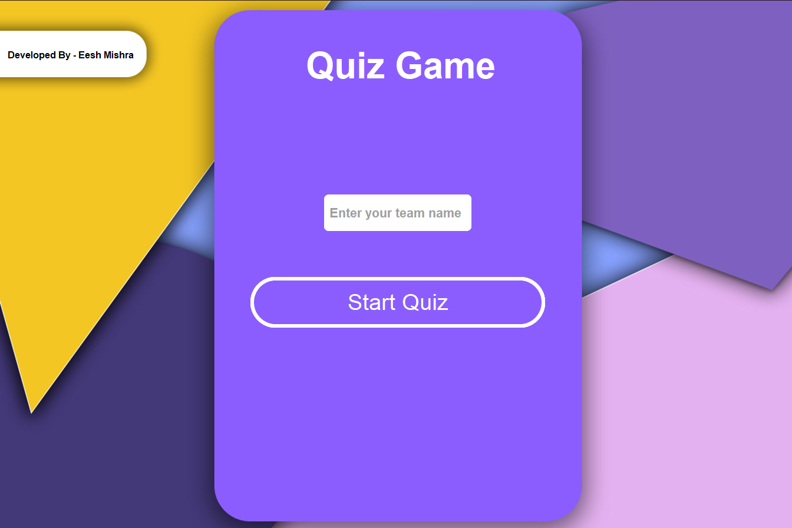

                                                                       # Quiz Game


<div style="display: flex; justify-content: center;"></div>


This is a simple quiz game created using CustomTkinter and PIL (Python Imaging Library) in Python. The game presents questions with three options for each question and keeps track of the user's score.


## Features

- **Graphical Interface**: Built using CustomTkinter for an enhanced UI experience.
- **Image Display**: Uses PIL for importing and displaying images within the game.
- **Multiple Choice Questions**: Provides three options for each question.
- **Score Tracking**: Automatically tracks and displays the user's score.

## Installation

1. **Clone the Repository**:
    ```bash
    git clone https://github.com/yourusername/quiz-game.git
    cd quiz-game
    ```

2. **Install Dependencies**:
    Ensure you have Python installed, then install the required packages:
    ```bash
    pip install customtkinter Pillow
    ```

## Usage

To run the quiz game, execute the following command:
```bash
python Qiz game.py
